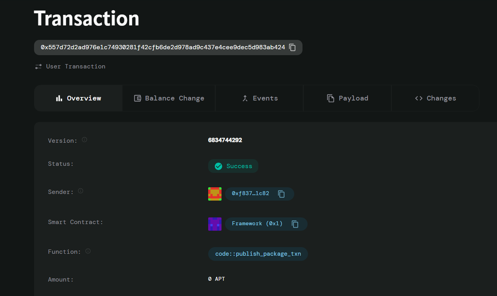

# Token Swap Contract

## Project Description

The Token Swap Contract is a decentralized smart contract built on the Aptos blockchain that enables users to swap tokens at a fixed 1:1 ratio. This contract provides a simple and efficient mechanism for token exchange through a liquidity pool system, allowing seamless trading between two different token types without complex pricing algorithms or slippage concerns.

## Project Vision

Our vision is to democratize token trading by providing a straightforward, transparent, and accessible swap mechanism on the Aptos ecosystem. We aim to eliminate the complexity often associated with decentralized exchanges while maintaining security and efficiency. By offering a 1:1 swap ratio, we create predictable trading conditions that benefit both casual users and DeFi enthusiasts looking for stable token exchange opportunities.

## Key Features

- **Simple 1:1 Token Swap**: Direct token exchange at a fixed one-to-one ratio
- **Liquidity Pool System**: Centralized pool management for continuous token availability
- **Swap Tracking**: Real-time monitoring of total swap transactions
- **Balance Management**: Automated tracking of token A and token B reserves
- **Security Assertions**: Built-in checks to ensure sufficient liquidity before swaps
- **Gas Efficient**: Minimal computational overhead with streamlined swap logic
- **Easy Integration**: Simple two-function interface for easy dApp integration
- **Transparent Operations**: All swap activities are recorded on-chain for full transparency

## Future Scope

- **Multi-Token Support**: Extend functionality to support multiple token pairs simultaneously
- **Dynamic Pricing**: Implement automated market maker (AMM) algorithms for variable pricing
- **Liquidity Provider Incentives**: Add reward mechanisms for users who provide liquidity to pools
- **Advanced Pool Management**: Implement features like pool creation, removal, and parameter adjustment
- **Cross-Chain Compatibility**: Enable token swaps across different blockchain networks
- **Governance Integration**: Add decentralized governance for protocol parameter changes
- **Fee Structure Implementation**: Introduce configurable transaction fees for protocol sustainability
- **Flash Swap Capabilities**: Enable advanced trading strategies through flash loan integration
- **Analytics Dashboard**: Comprehensive tracking and reporting of swap metrics and pool performance
- **Emergency Controls**: Implement pause/resume functionality for security and maintenance
- **Slippage Protection**: Add mechanisms to protect users from unexpected price movements
- **Time-Based Restrictions**: Implement cooldown periods and rate limiting for enhanced security

## Contract Details

0x557d72d2ad976e1c74930281f42cfb6de2d978ad9c437e4cee9dec5d983ab424

